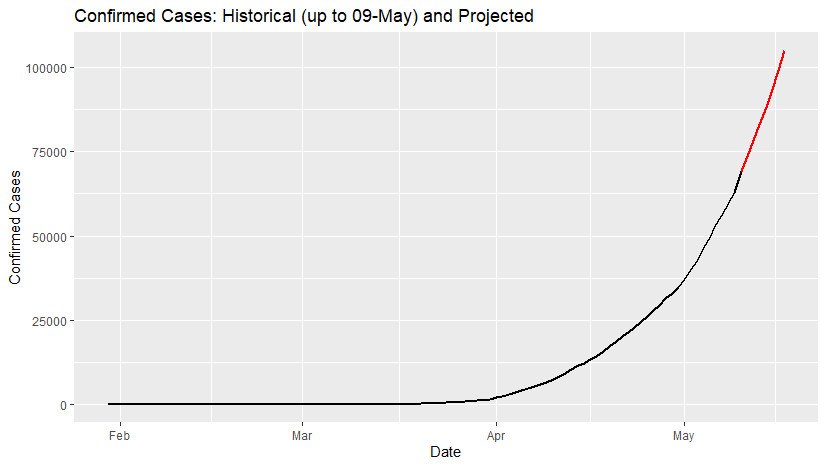
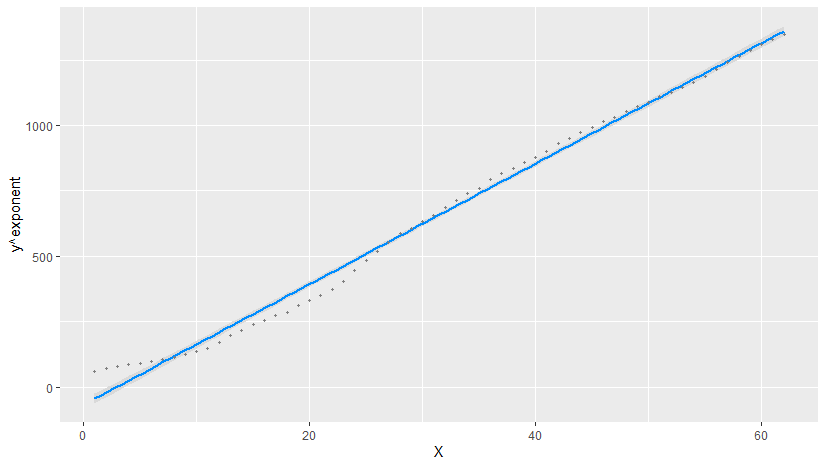

# Analyzing the Indian Covid-19 Story

Based on some simple analyses, I conclude that through most of Lockdown 1 and Lockdown 2, the Indian Covid-19 cases has followed a predictable trend, based on which my projections (in red) for the total number of confirmed cases as on 17-May is a little over 100,000. However numbers as of 15-May are much lower, which is great news!

{:height="50%" width="50%"}

In the figure below, the dots are actual cumulative cases (since 30th January) on a given day. The linear model fit looks good!
{:height="50%" width="50%"}