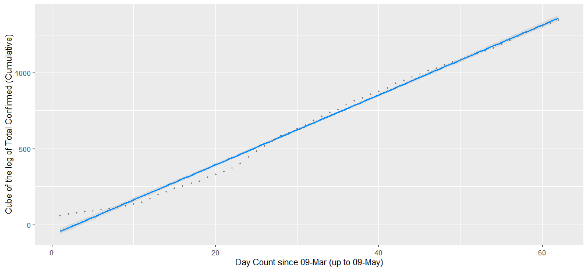

# Summary of Code in this Repo

All code are kept in code/

## Sourcing / Downloading / Cleaning Data -
- **source_data.R**: scrapes through the [Covid-19 India Tracker](https://api.covid19india.org/) to load latest Covid-19 data on India into your R-environment.
- **harvest_data.R**: does what *source_data.R* does, and in addition also stitches some disaggregated raw data and ensures dates are in workable formats.
- **state_wise_data.R**: collates state-wise data into state-specific time series datasets for each state. The data contains daily and cumulative confirmed, recovered and deceased cases for a given state from 14-Mar-2020. In order to check which state datasets are available at any given time:

```r
# Assuming your working directory is set to your local repo directory
source("code/state_wise_data.R")

# Print names of datasets for states (including UTs)
names(states_data)

# Data for the last 6 days for all states / UTs
lapply(states_data, tail)  # states_data is a list storing dataframes of alls states

# Data for Maharashtra
View(MH)  # or
View(states_data$MH)
```

## Analyzing Data -
- **broad_trends.R**: calls *harvest_data.R* and analyzes the *case_time_series.csv* dataset that has the following fields:
	* Confirmed (Daily, Total)
	* Recovered (Daily, Total)
	* Deceased (Daily, Total)
- **extrapolate_trends.R**: uses a time series of cumulative confirmed cases between to fit models between $log(y)^{exponent}$ and time, where $y$ is the total (cumulative) confirmed cases.


# Some Insights from Modeling the Evolution of Total Confirmed Covid-19 Cases in India


Based on some simple analyses, I conclude that through most of Lockdown 1 and Lockdown 2, Covid-19 cases in India have followed a predictable trend. Based on a model fit on 62 observations, my projections (in red) for the total number of confirmed cases for 17-May is a little over 100,000. 


In the figure below, the dots correspond to total confirmed (cumulative) number of cases since the first Covid-19 case was reported in India 30 Jan. The blue line corresponds to model predictions. The numbers of the y-axis, however, are transformed.  **The y-axis plots values of the *cube* of the *log* of cumulative cases between 30-Jan and the i-th date since 09-Mar, with i plotted on the x-axis.**
The fit looks good and explains > 99% of in-sample variance.



More analyses and models are expected to be updated to this space as more data comes in.


