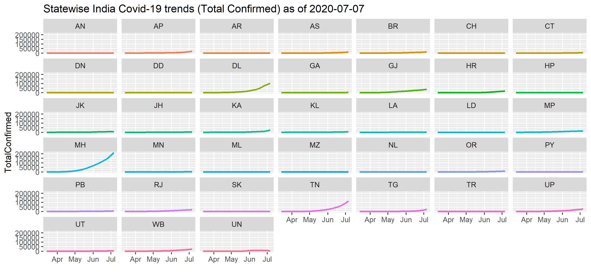
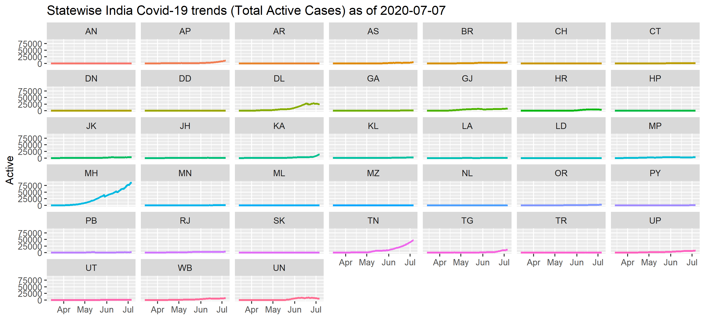

# Summary of Code in this Repo

All code are kept in code/

## Sourcing / Downloading / Cleaning Data -
- **source_data.R**: scrapes the [Covid-19 India Tracker](https://api.covid19india.org/) to load latest Covid-19 data on India into your R-environment.
- **harvest_data.R**: does what *source_data.R* does, and in addition also stitches some disaggregated raw data and ensures dates are in workable formats.
- **state_wise_data.R**: collates state-wise data into state-specific time series datasets for each state. The data contains daily and cumulative confirmed, recovered and deceased cases for a given state from 14-Mar-2020. In order to check which state datasets are available at any given time:
- **model_exponent.R**: Finds a linear relationship between the exponent of a data series and time stamps.
- **covid19_analysis.R**: one-stop (WIP) script with state-wise analyses.

# Some Insights from Modeling the Evolution of Total Confirmed Covid-19 Cases in India

India's Covid-19 situation can be explained by a simple model regressing an exponent of the logarithm of the total confirmed cases on a given date with respect to time (in days). The following plots depict the results of rolling-window regressions for calibration windows ranging between 25 days and 60 days. An increasing estimated exponent is a good thing - it means the rate of growth of total (cumulative) confirmed cases is decreasing.

# Latest state-wise Covid-19 Status

