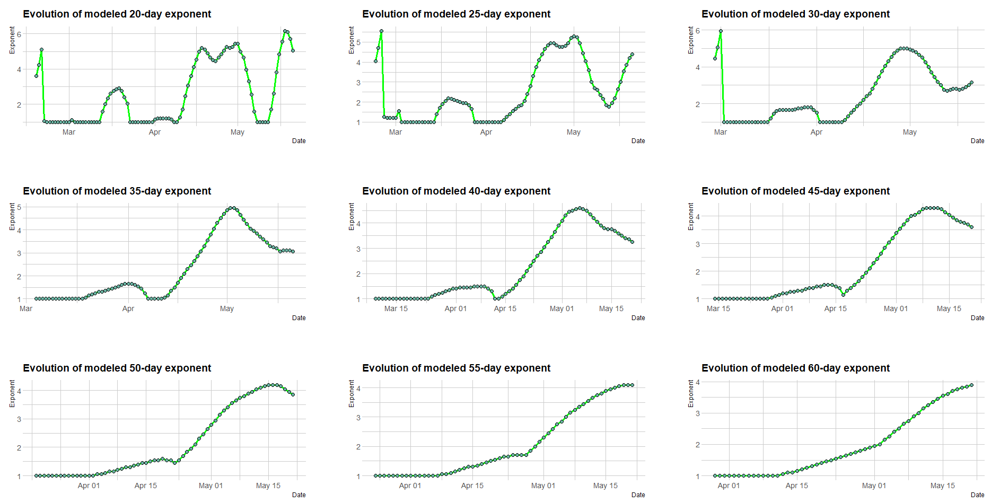
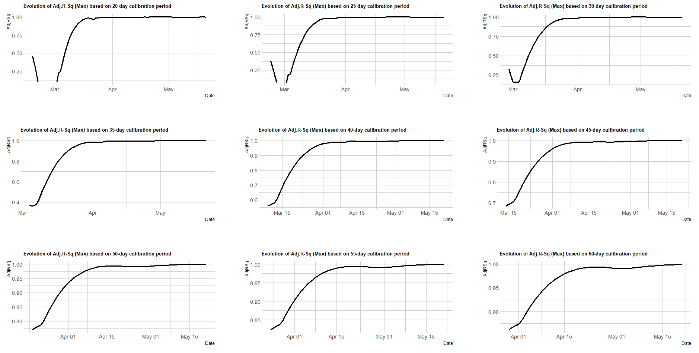

# Summary of Code in this Repo

All code are kept in code/

## Sourcing / Downloading / Cleaning Data -
- **source_data.R**: scrapes through the [Covid-19 India Tracker](https://api.covid19india.org/) to load latest Covid-19 data on India into your R-environment.
- **harvest_data.R**: does what *source_data.R* does, and in addition also stitches some disaggregated raw data and ensures dates are in workable formats.
- **state_wise_data.R**: collates state-wise data into state-specific time series datasets for each state. The data contains daily and cumulative confirmed, recovered and deceased cases for a given state from 14-Mar-2020. In order to check which state datasets are available at any given time:

```r
# Assuming your working directory is set to your local repo directory
source("code/state_wise_data.R")

# Print names of datasets for states (including UTs)
names(states_data)

# Data for the last 6 days for all states / UTs
lapply(states_data, tail)  # states_data is a list storing dataframes of alls states

# Data for Maharashtra
View(MH)  # or
View(states_data$MH)
```

## Analyzing Data -
- **broad_trends.R**: calls *harvest_data.R* and analyzes the *case_time_series.csv* dataset that has the following fields:
	* Confirmed (Daily, Total)
	* Recovered (Daily, Total)
	* Deceased (Daily, Total)
	
- **extrapolate_trends.R**: Attempts to model the exponent in  regressed against time (in days), where *y* is the total(cumulative) number of cases on a given date.


# Some Insights from Modeling the Evolution of Total Confirmed Covid-19 Cases in India

India's Covid-19 situation can be explained by a simple model regressing an exponent of the logarithm of the total confirmed cases on a given date with respect to time (in days). The following plots depict the results of rolling-window regressions for calibration windows ranging between 25 days and 60 days. An increasing estimated exponent is a good thing - it means the rate of growth of total (cumulative) confirmed cases is decreasing.



The estimated exponent for a calibration period is chosen to maximize the adjusted R-squared in the exponent iterval between 1 and 10. Time series of adjsuted R-squared of models fit using estimated exponents (corresponding to each calibration window) are presented below.  



More analyses and models are expected to be updated to this space as more data comes in.


